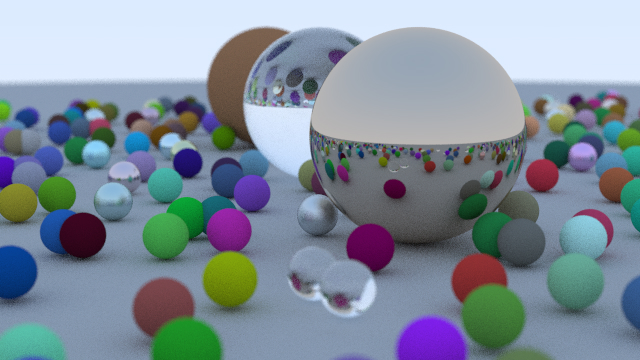

# performance


> spp 500

AMD Ryzen 9 5900x 12c24t

```cpp
cam.max_depth         = 50;
cam.samples_per_pixel = 100;
```

| mode(spp 100)      | time | 
|--------------------|------|
| single-thread code | 237s |
| multi-thread code  | 21s  |

