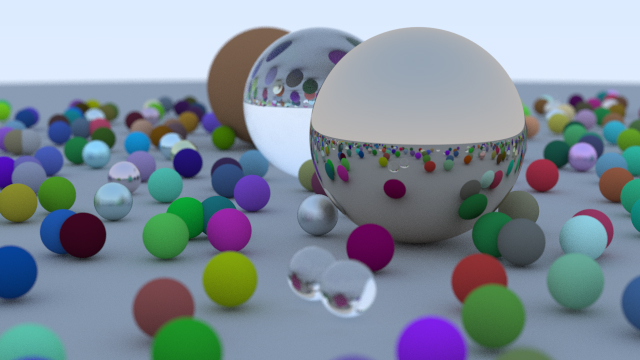

# performance


> spp 500

AMD Ryzen 9 5900x 12c24t

```cpp
cam.max_depth         = 50;
cam.samples_per_pixel = 100;
```

| mode(spp 100)      | time(with out bvh) | time(with  bvh) |
|--------------------|--------------------|-----------------|
| single-thread code | 237s               | 33.6s           |
| multi-thread code  | 21s                | 6.3s            |

| mode(spp 500)     | time(with bvh) |
|-------------------|----------------|
| multi-thread code | 31.6s          |
